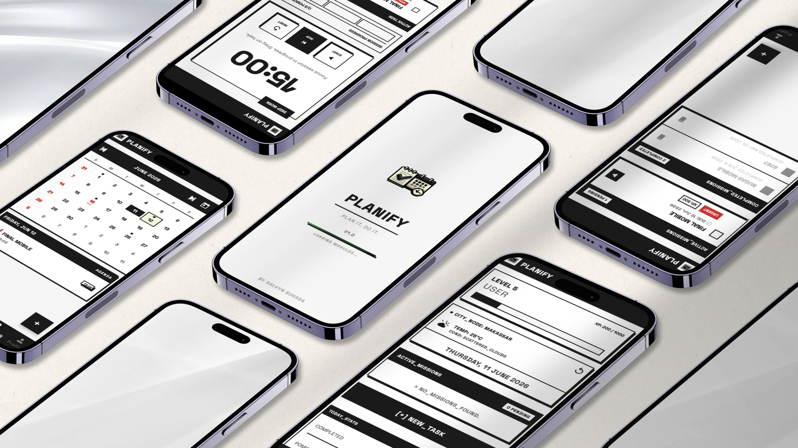

<div align="center">
  
</div>

<br/>

<div align="center">

# Planify

**Aplikasi produktivitas Android bergaya 8-bit yang dirancang untuk orang yang serius soal waktu mereka (Asik ee).**

[](#)
[](#)
[](#)
[](#)

</div>

---

## Tentang Aplikasi

**Planify** adalah aplikasi *task manager* inovatif berbasis Android native yang mengusung estetika **Retro 8-Bit Brutalist**. Dirancang khusus sebagai proyek akhir semester, aplikasi ini bertujuan menciptakan ruang kerja digital bebas distraksi dengan menyatukan manajemen tugas harian, sesi fokus Pomodoro, sinkronisasi Google Calendar, serta widget cuaca real-time ke dalam satu dashboard *high-contrast* yang interaktif.

Setiap interaksi tombol memicu feedback audio retro 8-bit yang khas, memberikan kepuasan instan layaknya menyelesaikan misi di dalam *game classic*.

---

## Fitur Utama

Berikut adalah modul navigasi & fitur unggulan yang terintegrasi di dalam Planify:

### ⊡ `01` Task Manager (Manajemen Misi)
* **Kontrol Penuh**: Tambah, edit, dan hapus tugas harian Anda secara dinamis.
* **Prioritas Misi**: Tentukan tingkat urgensi tugas menggunakan indikator prioritas `Low`, `Medium`, atau `High`.
* **State Management**: Sistem tracking otomatis yang memisahkan tugas aktif (`Pending`) dan tugas selesai (`Completed`).
* **Offline First**: Semua data tersimpan aman secara lokal tanpa memerlukan koneksi internet melalui database SQLite (Room Persistence Library).

### ⏱ `02` Pomodoro Timer (Modul Fokus)
* **Sesi Pomodoro**: Siklus fokus terintegrasi (25 menit kerja, diikuti dengan 5 menit istirahat).
* **Retro Progress**: Animasi loading bar pixelated yang estetik saat timer berjalan.
* **Mission Tracker**: Setiap sesi yang sukses diselesaikan otomatis direkam dan dikonversi menjadi poin statistik harian Anda.

### 📅 `03` Google Calendar Sync (Sinkronisasi Orbit)
* **Real-time Sync**: Tampilkan jadwal acara pribadi dari Google Calendar langsung pada tab kalender aplikasi.
* **Google OAuth**: Integrasi API yang aman dengan Google Sign-In tanpa mengganggu sistem autentikasi lokal aplikasi.

### 🌤 `04` Weather Widget (Sensor Cuaca)
* **Deteksi Lokasi**: Integrasi GPS Location Services untuk membaca posisi geografis secara otomatis.
* **Informasi Real-Time**: Data cuaca dan suhu ditarik langsung dari OpenWeather API.
* **Smart Cache**: Dilengkapi sistem penyimpanan cache untuk menghemat kuota data seluler Anda.

### 👤 `05` Profile & Mission Stats (Terminal Profil)
* **Statistik Produktivitas**: Pantau metrik kemajuan Anda seperti *Completion Rate*, *Total Pomodoro*, dan rekor hari beruntun (*Streak*).
* **Custom Avatar**: Ambil gambar langsung dari Galeri HP Anda, dengan pemrosesan *auto-crop* persegi yang selaras dengan tema Brutalist.

### ⚙️ `06` Settings (Pusat Kontrol)
* **Kustomisasi Durasi**: Atur panjang sesi Pomodoro sesuai preferensi fokus Anda.
* **Manajemen Tema**: Dukungan mode gelap (*Dark Mode*), mode terang (*Light Mode*), atau mengikuti sistem Android (*System Default*).
* **Audio Switch**: Aktifkan atau matikan musik & efek suara retro 8-bit kapan saja.

---

## 📸 App Preview

<div align="center">
  
</div>

---

## 🛠️ Tech Stack & Arsitektur

Konstruksi teknis Planify dibangun menggunakan standar pengembangan Android modern dan stabil:

| Komponen | Implementasi Teknologi |
| :--- | :--- |
| **Language** | <code>Java 17</code> (LTS) |
| **Architecture** | <code>MVVM</code> (Model-View-ViewModel) dengan <code>LiveData</code> & <code>ViewModel</code> |
| **User Interface** | <code>ViewBinding</code>, <code>Material Design 3</code>, Custom Shape & XML Vectors |
| **Database** | <code>Room DB</code> (SQLite Wrapper), <code>SharedPreferences</code> |
| **Networking** | <code>Retrofit 2</code>, <code>OkHttp 3</code> (untuk REST API) |
| **Google Services** | <code>Play Services Location</code>, <code>Google Calendar API</code>, <code>Google Sign-In</code> |
| **Visual Effects** | <code>Facebook Shimmer</code> (efek loading skeleton), Custom bitmap cropping |
| **Audio Engine** | <code>SoundPool</code> / <code>MediaPlayer</code> (gaya Retro SoundManager) |

---

## Cara Menjalankan

**Prasyarat:** Android Studio + JDK 17 + device/emulator Android 11+ (API 30+)

```bash
# 1. Clone repo
git clone https://github.com/username-anda/planify.git

# 2. Buka di Android Studio, lalu sync Gradle

# 3. Buat file local.properties di root project, tambahkan:
WEATHER_API_KEY=your_openweather_api_key_here

# 4. Taruh google-services.json ke folder app/
#    (diperlukan untuk fitur Google Calendar)

# 5. Run
./gradlew assembleDebug
```

> **Catatan:** Tanpa `google-services.json`, fitur Calendar tidak akan berfungsi. Fitur lain (Task, Pomodoro, Weather, Profile) tetap bisa digunakan secara offline.

---

## Struktur Project

```
app/src/main/java/com/example/planify/
├── data/
│   ├── local/          # Room DAO, Entity, Database
│   ├── remote/         # Retrofit API service & model
│   └── repository/     # TaskRepo, WeatherRepo
├── service/            # PomodoroTimerService (foreground)
├── receiver/           # NotificationReceiver
├── ui/
│   ├── activity/       # Login, Signup, Splash, EditProfile, dll
│   ├── fragment/       # Home, Task, Pomodoro, Calendar, Profile
│   ├── viewmodel/      # TaskVM, WeatherVM, CalendarVM
│   ├── adapter/        # RecyclerView adapters
│   └── bottomsheet/    # Bottom sheet dialogs
└── utils/              # Constants, SoundManager, AvatarUtils, dll
```

---

<sub>Dibuat untuk Final Lab Semester 4 · 2026</sub>
